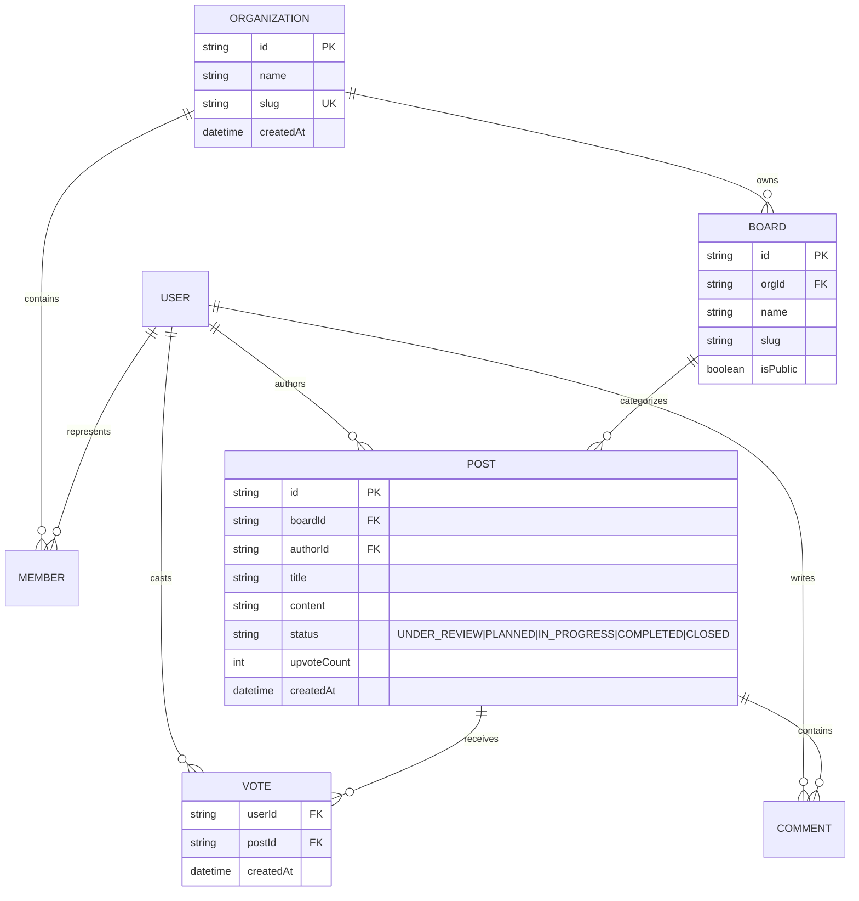

# Software Requirements Specification (SRS)
## Project: FeaturePulse — Team Feedback & Public Roadmap SaaS

**Document Version:** 1.0.0  
**Status:** Approved  
**Target Stack:** Next.js 16 (App Router), React 19, TypeScript, Tailwind CSS 4, daisyUI 5  
**Architectural Standard:** Conforms strictly to [`AGENTS.md`](./AGENTS.md)

---

## 1. Executive Summary & Product Vision

### 1.1 Purpose
**FeaturePulse** is a lightweight, high-performance B2B SaaS application inspired by Canny and Linear Insights. It bridges the gap between software teams and their users by enabling teams to collect customer feature requests, let users upvote and discuss ideas, and publish transparent, real-time public roadmap boards.

### 1.2 Core Objectives
- Provide a dual-sided application: a public-facing, SEO-optimized community portal and a secure, multi-tenant administrative dashboard.
- Serve as the reference implementation for modern Next.js 16 architecture: React Server Components (RSC) by default, Server Actions with runtime schema validation, dual-layer security boundaries (`proxy.ts` + Data Access Layer), and deep URL-driven state synchronization.
- Guarantee sub-second page transitions, zero Cumulative Layout Shift (CLS), and optimistic user interactions (e.g., instant upvoting).

---

## 2. User Roles & Personas

| Role | Description | Access Level |
| :--- | :--- | :--- |
| **Anonymous Visitor** | External end-user browsing public roadmaps. | Read-only access to public boards and posts. Can view post details, comments, and roadmap columns. |
| **Authenticated Contributor** | Customer or community member signed in via magic link or OAuth. | Can upvote posts, submit new feedback requests, and participate in discussion threads. |
| **Team Member / Admin** | Product manager, engineer, or founder belonging to the tenant organization. | Full management rights: change post statuses (Under Review, Planned, In Progress, Complete, Closed), merge duplicate requests, configure board visibility, and manage organization settings. |

---

## 3. System Architecture & Tech Stack

```mermaid
graph TD
    Client[Browser / Client Island] -->|HTTP Request| Proxy[proxy.ts - Edge/Network Boundary]
    Proxy -->|Pass / Reject| AppRouter[Next.js 16 App Router]
    
    subgraph "Server Environment"
        AppRouter -->|Page Render| RSC[Server Components]
        AppRouter -->|Form Submit| SA[Server Actions]
        
        RSC --> DAL[Data Access Layer - lib/auth/dal.ts]
        SA --> DAL
        
        DAL --> Services[Domain Services / Repositories]
        Services --> DBClient[(Database Client - globalThis Singleton)]
    end
    
    subgraph "Client Boundary (Leaf Islands Only)"
        Client --> UpvoteBtn[<UpvoteButton /> (Optimistic)]
        Client --> URLFilter[<RoadmapFilters /> (nuqs / searchParams)]
        Client --> PostModal[<FeedbackModal /> (useActionState)]
    end
```

### 3.1 Technology Stack
- **Framework:** Next.js 16 (App Router, Turbopack, React 19).
- **Styling & UI:** Tailwind CSS 4 (CSS-first engine), daisyUI 5 (semantic component classes, theme engine).
- **Language:** TypeScript 5.x (Strict mode, `noImplicitAny: true`).
- **Data Persistence:** PostgreSQL or SQLite via Drizzle ORM / Prisma (client instance managed as a `globalThis` singleton).
- **Validation:** Zod 3.x / 4.x for runtime payload verification and boot-time environment parsing (`lib/env.ts`).
- **State Management:** URL search parameters for all sharable UI state (`nuqs` or native `useSearchParams`); local `useState` restricted to leaf interactivity.

---

## 4. Functional Requirements

### 4.1 Module: Authentication & Organization Management (`features/auth`, `features/organization`)
- **FR-AUTH-01 (Session Management):** The system shall support session tokens stored in secure, `httpOnly`, `SameSite=Lax` cookies.
- **FR-AUTH-02 (Dual-Layer Route Protection):**
  - **Layer 1 (Network Boundary):** `proxy.ts` verifies session presence. If missing, requests to `/dashboard/*` redirect to `/login?redirect=...`.
  - **Layer 2 (Data Boundary):** The Data Access Layer (`lib/auth/dal.ts`) validates tenant membership and permissions before any data is read or written. (Mitigates CVE-2025-29927).
- **FR-AUTH-03 (Tenant Isolation):** All database queries for organization data must strictly scope to `organizationId`.

### 4.2 Module: Feedback & Ideation (`features/feedback`)
- **FR-FEED-01 (Submit Request):** Authenticated users can submit a feature request containing a Title (max 100 chars), Description (markdown supported, max 2000 chars), and Category tag.
- **FR-FEED-02 (Input Validation):** All submissions to the `createFeedbackAction` Server Action must pass runtime validation via `createFeedbackSchema` (Zod). Invalid payloads return localized field errors without throwing unhandled exceptions.
- **FR-FEED-03 (Upvoting with Optimistic UI):**
  - Users can toggle an upvote on any active feedback item.
  - The client UI must update the upvote count and active state instantaneously via React optimistic state while the Server Action executes in the background.
  - If the server mutation fails, the UI rolls back automatically and displays an alert toast.
- **FR-FEED-04 (Discussion Threads):** Users can post comments on feedback posts. Admin comments must display an "Official Response" badge.

### 4.3 Module: Public Roadmap Board (`features/roadmap`)
- **FR-ROAD-01 (Kanban Columns):** The roadmap view organizes posts into columns based on status:
  1. `PLANNED`
  2. `IN_PROGRESS`
  3. `COMPLETED`
- **FR-ROAD-02 (URL-Driven Filtering & Search):**
  - Active status filters (`?status=in-progress,planned`), search keywords (`?q=billing`), tag filters (`?tag=api`), and active detail views (`?post=123`) must sync directly to URL query parameters.
  - Deep links must be shareable and re-render identically across browser sessions.
- **FR-ROAD-03 (Dynamic SEO & OpenGraph):**
  - Public detail pages (`/p/[boardSlug]/posts/[id]`) must export `generateMetadata()` generating page-specific `<title>`, `<meta name="description">`, OpenGraph image, and Twitter cards.
  - Root layout must specify `metadataBase` to ensure consistent canonical and asset URLs.

### 4.4 Module: Admin Backoffice (`features/dashboard`)
- **FR-DASH-01 (Status Management):** Admins can update the workflow status of any post (`UNDER_REVIEW` → `PLANNED` → `IN_PROGRESS` → `COMPLETED` → `CLOSED`).
- **FR-DASH-02 (Internal Roadmapping):** Admins can toggle whether a post is visible on the public roadmap board.
- **FR-DASH-03 (Changelog Generator):** Automatically create a draft changelog entry when posts transition to `COMPLETED`.

---

## 5. Non-Functional Requirements

### 5.1 Performance & Core Web Vitals
- **NFR-PERF-01 (Zero Layout Shift):** All web fonts must be loaded via `next/font` (self-hosted at build time). Images must utilize `next/image` with explicit width/height or `fill` ratios.
- **NFR-PERF-02 (Explicit Caching):** Every `fetch` request must document its caching strategy:
  - Public roadmap boards: `revalidate: 60` (ISR/stale-while-revalidate).
  - Admin dashboards & user profile data: `cache: 'no-store'`.
- **NFR-PERF-03 (Fast First Paint):** Skeletons rendered via `loading.tsx` must display daisyUI skeleton primitives during async data fetching.

### 5.2 Security & Data Integrity
- **NFR-SEC-01 (No Secret Leaks):** Secrets (`DATABASE_URL`, `AUTH_SECRET`) are parsed at boot time via `lib/env.ts`. No server environment variable may ever be prefixed with `NEXT_PUBLIC_` unless intentionally public.
- **NFR-SEC-02 (Client Bundle Minimization):** Zero `"use client"` directives in layout or top-level page components. Client islands must be confined to interactive leaves (`<UpvoteButton />`, `<FilterBar />`, `<FeedbackModal />`).
- **NFR-SEC-03 (Connection Pool Preservation):** The database connection pool must be attached to `globalThis` in development to prevent connection exhaustion during Fast Refresh cycles.

### 5.3 Accessibility (a11y) & Theming
- **NFR-A11Y-01:** Full keyboard navigation support (WCAG 2.1 AA compliant) for modals, buttons, and form controls.
- **NFR-THEME-01:** Theme switching (light / dark / corporate) managed at the root `<html>` attribute via daisyUI tokens, with no hard-coded hex colors in component code.

---

## 6. Domain Data Model & Entity Relationships



---

## 7. Contract Specifications

### 7.1 Server Action Response Contract
All Server Actions strictly return a typed discriminant union:
```typescript
export type ActionResponse<T> =
  | { success: true; data: T; errors?: never }
  | { success: false; errors: Record<string, string[]>; data?: never };
```

### 7.2 Core Mutation Contracts
1. **`createFeedbackAction(prevState, formData: FormData): Promise<ActionResponse<Post>>`**
   - Validates `title` (3-100 chars), `content` (10-2000 chars), `boardId` (UUID).
   - Verifies authenticated session via Data Access Layer.
   - Inserts record and calls `revalidatePath('/p/[boardSlug]')`.
2. **`toggleUpvoteAction(postId: string): Promise<ActionResponse<{ upvoted: boolean; count: number }>>`**
   - Atomically toggles vote record in `votes` table.
   - Increments or decrements `posts.upvoteCount`.
   - Returns the updated vote count and user state.
3. **`updatePostStatusAction(postId: string, newStatus: PostStatus): Promise<ActionResponse<Post>>`**
   - Requires admin session authorization via DAL.
   - Updates status and triggers revalidation for both the admin board and the public roadmap.

---

## 8. File & Directory Layout

Following Section 1 of `AGENTS.md`, route files are strictly presentation shells; business logic and UI reside in feature modules:

```text
├── app/
│   ├── (auth)/
│   │   ├── login/page.tsx
│   │   └── layout.tsx
│   ├── (dashboard)/
│   │   ├── dashboard/
│   │   │   ├── page.tsx
│   │   │   ├── loading.tsx
│   │   │   └── error.tsx
│   │   └── layout.tsx
│   ├── (public)/
│   │   ├── p/[boardSlug]/
│   │   │   ├── page.tsx
│   │   │   ├── posts/[id]/page.tsx
│   │   │   ├── loading.tsx
│   │   │   ├── not-found.tsx
│   │   │   └── error.tsx
│   │   └── layout.tsx
│   ├── layout.tsx
│   ├── not-found.tsx
│   └── error.tsx
├── proxy.ts                         # Edge/network boundary (Next.js 16)
├── components/
│   └── ui/                          # Shared cross-domain UI primitives
│       ├── button.tsx
│       ├── card.tsx
│       ├── modal.tsx
│       └── skeleton.tsx
├── features/
│   ├── auth/                        # Auth logic, session handlers, DAL
│   │   ├── dal.ts
│   │   └── routes.ts
│   ├── feedback/                    # Feedback posts, voting, comments
│   │   ├── actions.ts
│   │   ├── schemas.ts
│   │   ├── queries.ts
│   │   └── components/
│   │       ├── upvote-button.tsx
│   │       ├── feedback-card.tsx
│   │       └── feedback-form.tsx
│   ├── roadmap/                     # Public roadmap boards & columns
│   │   ├── queries.ts
│   │   └── components/
│   │       ├── roadmap-column.tsx
│   │       └── filter-bar.tsx
│   └── organization/                # Multi-tenancy & settings
├── lib/
│   ├── db.ts                        # GlobalThis database client singleton
│   ├── env.ts                       # Typed boot-time environment schema
│   └── utils.ts
├── AGENTS.md                        # Standing architectural contract
└── SRS.md                           # This specification
```

---

## 9. Verification & Acceptance Criteria

| ID | Test Scenario | Acceptance Criteria |
| :--- | :--- | :--- |
| **AC-01** | Unauthenticated user accesses `/dashboard` | Request intercepted by `proxy.ts` and redirected to `/login`. |
| **AC-02** | User clicks `<UpvoteButton />` | Button state and count increment instantly. Network call updates DB. If server fails, button reverts cleanly and shows error message. |
| **AC-03** | User applies filter `?status=planned` | Server Component receives query parameter and returns only `PLANNED` posts without full page reload. URL is shareable. |
| **AC-04** | Invalid form submit (title < 3 chars) | Server Action rejects payload; validation message renders below title input without throwing raw exceptions. |
| **AC-05** | Public post link shared on social media | Crawler extracts dynamically generated OpenGraph title, description, and canonical URL matching post data. |
| **AC-06** | Database client during development | Hot reload triggers no multiple-pool warnings; singleton client on `globalThis` persists cleanly. |
